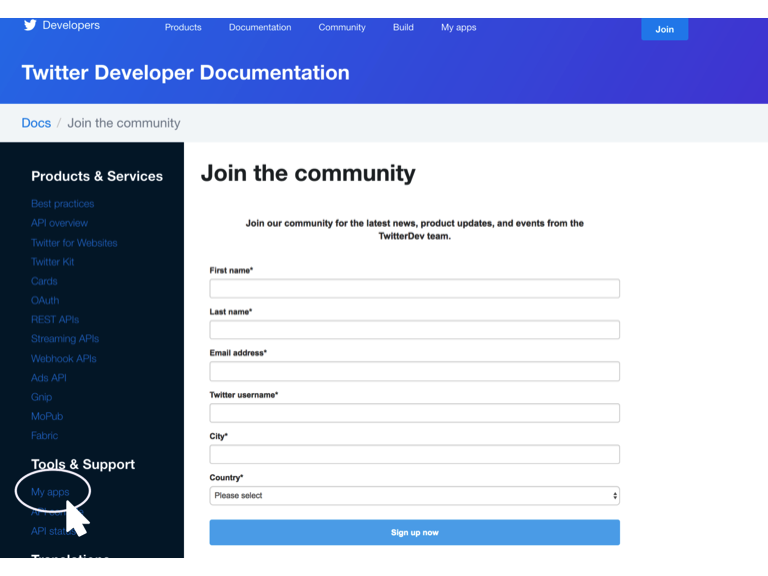
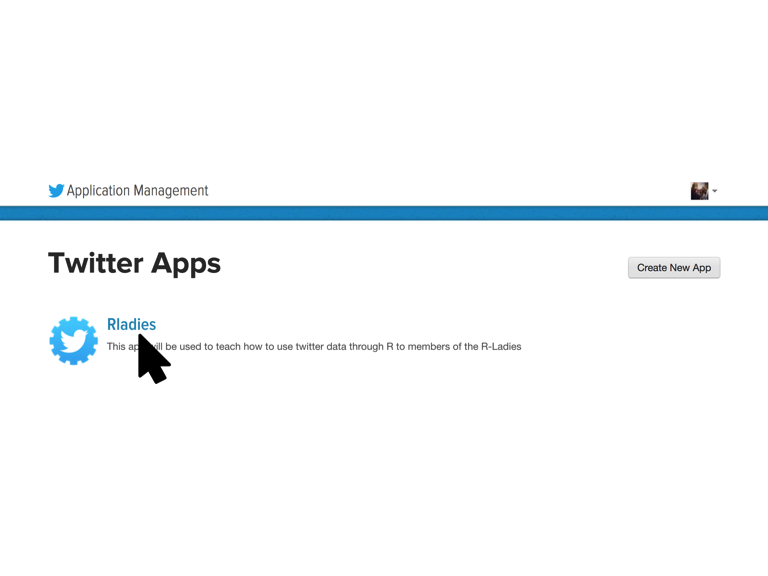
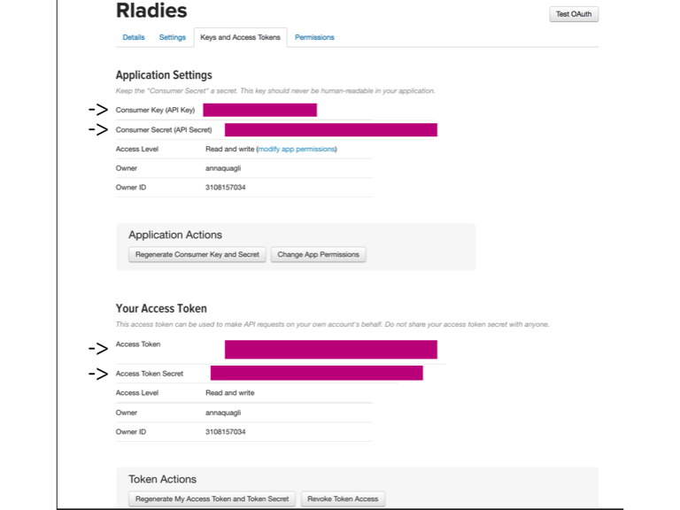
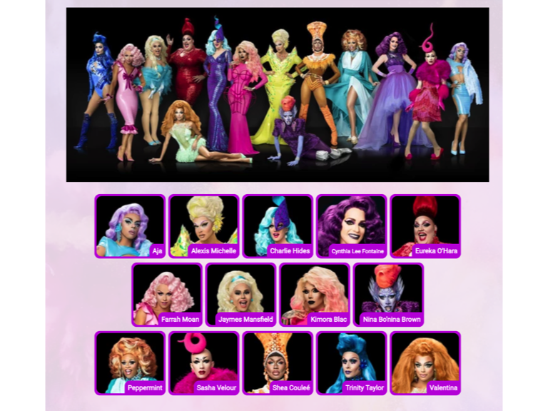
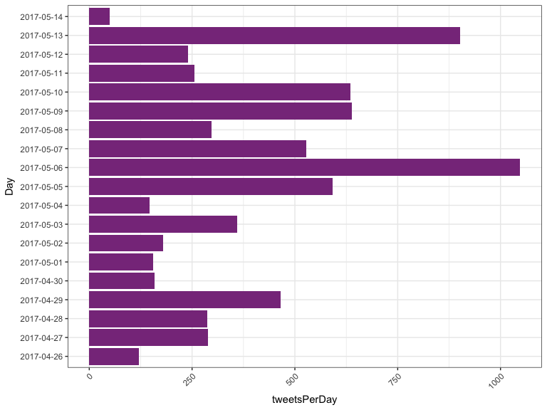
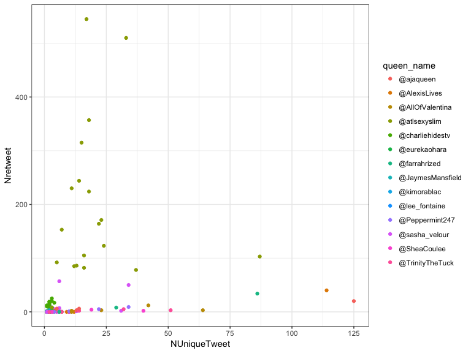
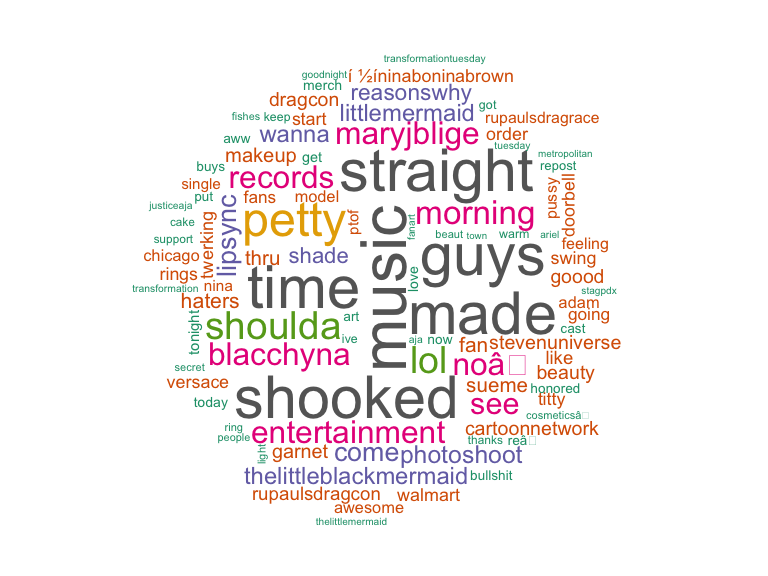
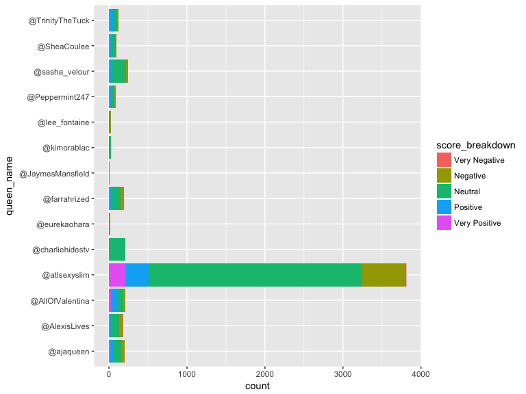
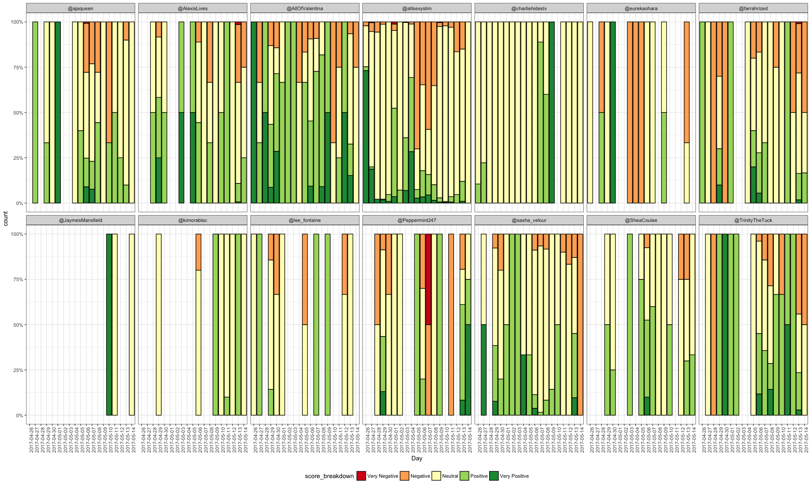

R-Ladies Melbourne - Twitter Workshop
================
Anna Quaglieri & Saskia Freytag
15th May 2017

-   [Set up a twitter API](#set-up-a-twitter-api)
-   [Let's get started with RuPaul's drag race's tweets!](#lets-get-started-with-rupauls-drag-races-tweets)
    -   [Research your hashtags](#research-your-hashtags)
    -   [Initialize functions needed for the analyses](#initialize-functions-needed-for-the-analyses)
    -   [Start and plan your search](#start-and-plan-your-search)
        -   [Download the tweets](#download-the-tweets)
        -   [User's information](#users-information)
    -   [Some analysis](#some-analysis)
        -   [How many times is a drag queen mentioned daily?](#how-many-times-is-a-drag-queen-mentioned-daily)
        -   [How come @atlsexyxlim has such huge number of tweets?](#how-come-atlsexyxlim-has-such-huge-number-of-tweets)
        -   [What are the most common words used in @atlsexyslim tweets?](#what-are-the-most-common-words-used-in-atlsexyslim-tweets)
        -   [Sentiment analysis](#sentiment-analysis)
-   [Now make your own analysis!](#now-make-your-own-analysis)
    -   [Participant competition winner!](#participant-competition-winner)

Set up a twitter API
====================

Before you can download data from Twitter, you need to setup your API by becoming a Twitter developer. First, to become a Twitter developer you need to have a Twitter account. Then, you can sign up [here](https://dev.twitter.com/resources/signup) (Figure 1). Once you have signed up click on the *My Apps* buttom on the left panel as in Figure 2 and then click on *Create a new app*. You should provide a brief description about your App and a few other details. For today's workshop we set up the the *Rladies* App shown in Figure 3. By clicking onto your App's name you can now manage and see your settings as well as the codes that you need to get started with R. You can find the keys that you need in the *Keys and Access Tokens* button. Here you can find your four codes (highlighted in Figure 4) to use into R.

------------------------------------------------------------------------


**Figure 1**

------------------------------------------------------------------------



**Figure 2**

------------------------------------------------------------------------



**Figure 3**

------------------------------------------------------------------------



**Figure 4**

------------------------------------------------------------------------

Let's get started with RuPaul's drag race's tweets!
===================================================

RuPaul's drag race is an American reality competitions showing RuPaul's search for "America's next drag superstar". Just to tease your curiosity, Figure 5 shows you all the Queens which are competing in Season 9!

------------------------------------------------------------------------



**Figure 5**

------------------------------------------------------------------------

Research your hashtags
----------------------

The first thing to do when you want to analyse a topic using Twitter's data is to know what is or are the most useful *hastag/s* that can describe your questions. This means those hastags that are most commonly used when what you are interested in is tweeted. In this example we are interested into the trends of [RuPaul's drag race Season 9](http://logosrupaulsdragrace.wikia.com/wiki/RuPaul%27s_Drag_Race_(Season_9)). A little bit of research through Twitter or Goggle is needed to define a set of good hastags. For example, we found a web page listing the top hashtags for RuPaul's drag race <https://top-hashtags.com/hashtag/rupaul/>. For simplicity we will limit our search to two hastags and we decided to use one specific for season 9, `#rpdr9`, and a more general one, `#rupaulsdragrace`.

Initialize functions needed for the analyses
--------------------------------------------

First, start by installing and loading all the necessary packages.

``` r
> ## Initialize functions needed for the analyses
> ## Packages that you need to setup your API in R and
> ## download twitter data
> install.packages("twitteR")
> install.packages("ROAuth")
> install.packages("RCurl")
> install.packages("RJSONIO")
> 
> # Packages for sentiment analyses and wordclouds
> install.packages("RSentiment")
> install.packages("tm")
> install.packages("wordcloud")
> 
> # Genral R packages for plotting and manipulating
> # data
> install.packages("tidyr")
> install.packages("dplyr")
> install.packages("ggplot2")
> install.packages("plotly")
> install.packages("stringr")
> install.packages("knitr")
```

``` r
> # Require all packages
> require("tm")
> require("wordcloud")
> require("twitteR")
> require("ROAuth")
> require("RCurl")
> require("RJSONIO")
> require("tidyr")
> require("dplyr")
> require("ggplot2")
> require("plotly")
> library("stringr")
> library("knitr")
> source(file.path(dir, "score_sentiment.R"))
```

Then setup your `access keys` as below. If you don't remember where to find these codes see Figure 1).

``` r
> api_key <- "yourAPIKey"
> api_secret <- "yourAPISecret"
> token <- "yourToken"
> token_secret <- "yourTokenSecret"
> 
> twitteR::setup_twitter_oauth(api_key, api_secret, token, 
+     token_secret)
```

Start and plan your search
--------------------------

Twitter only allows you to retrieve tweets up to about two weeks before. Therefore, if you are planning to analyse some particular tweets across few weeks or months you will have to plan the downloading about every two weeks. For example, for this workshop we downloaded data on the 5th of May and on the 14th of May using the code below:

### Download the tweets

``` r
> ### Download the tweets
> # Download only English tweets
> # 5th of May
> twittes_rpdr9_1 <- twitteR::searchTwitter("#rpdr9", n = 3000, lang= "en", since= "2017-03-01")
> # 14th May
> twittes_rpdr9_2 <- twitteR::searchTwitter("#rpdr9", n = 3000, lang= "en", since= "2017-03-01")
> twittes_rpdr <- twitteR::searchTwitter("#rupaulsdragrace", n = 3000, lang= "en", since= "2017-03-01")
> 
> # Save output as R objects
> saveRDS(twittes_rpdr9_2, file.path(dir,"Data","twitter_rpdr9.rds")
> saveRDS(twitter_rpdr9, file.path(dir,"Data","twitter_rpdr9_2.rds")
> saveRDS(twittes_rpdr, file.path(dir,"Data","twitter_rupoldragrace.rds")
```

Now, read into R the two sets of tweets that we previously downloaded.

``` r
> # Load the files got from twitteR::searchTwitter
> # run three times
> twitter_rpdr9_1 <- readRDS(file.path(dir, "Data", "twitter_rpdr9.rds"))
> twitter_rpdr9_2 <- readRDS(file.path(dir, "Data", "twitter_rpdr9_2.rds"))
> twitter_rpdr <- readRDS(file.path(dir, "Data", "twitter_rupoldragrace.rds"))
> class(twitter_rpdr9_1)
```

    ## [1] "list"

``` r
> # Convert the lists to data.frames
> toDF_rupol_1 <- twitteR::twListToDF(twitter_rpdr9_1)
> toDF_rupol_2 <- twitteR::twListToDF(twitter_rpdr9_2)
> toDF_rupol_3 <- twitteR::twListToDF(twitter_rpdr)
```

Now we would like to combine the two sets of tweets and remove overlapping tweets since there is overlap in the days.

``` r
> # Time interval of the tweets dates Set 1
> min(toDF_rupol_1$created)
```

    ## [1] "2017-04-26 13:22:29 UTC"

``` r
> max(toDF_rupol_1$created)
```

    ## [1] "2017-05-06 00:56:42 UTC"

``` r
> # Set 2
> min(toDF_rupol_2$created)
```

    ## [1] "2017-05-04 21:01:33 UTC"

``` r
> max(toDF_rupol_2$created)
```

    ## [1] "2017-05-14 01:56:04 UTC"

``` r
> # Set 3
> min(toDF_rupol_3$created)
```

    ## [1] "2017-05-04 21:48:35 UTC"

``` r
> max(toDF_rupol_3$created)
```

    ## [1] "2017-05-14 03:29:49 UTC"

``` r
> # There is a two days overlap
> 
> # Combine the data.frame and remove duplicated
> # tweets
> combineTweetsDupl <- rbind(toDF_rupol_1, toDF_rupol_2, 
+     toDF_rupol_3)
> duplicatedRows <- duplicated(combineTweetsDupl)
> sum(duplicatedRows)
```

    ## [1] 162

``` r
> combineTweets <- combineTweetsDupl[!duplicatedRows, 
+     ]
> sum(duplicated(combineTweets))
```

    ## [1] 0

``` r
> colnames(combineTweets)
```

    ##  [1] "text"          "favorited"     "favoriteCount" "replyToSN"    
    ##  [5] "created"       "truncated"     "replyToSID"    "id"           
    ##  [9] "replyToUID"    "statusSource"  "screenName"    "retweetCount" 
    ## [13] "isRetweet"     "retweeted"     "longitude"     "latitude"

``` r
> # Save the clean data to file
> write.csv(combineTweets, file.path(dir, "Data", "tweets_hastags_combined.csv"), 
+     row.names = FALSE)
```

With the help of [tidyr](https://cran.r-project.org/web/packages/tidyr/index.html) we can reorganise and manipulate the dataset. For example, we can plot the number of tweets per day.

``` r
> combineTweets <- read.csv(file.path(dir, "Data", "tweets_hastags_combined.csv"))
> colnames(combineTweets)
```

    ##  [1] "text"          "favorited"     "favoriteCount" "replyToSN"    
    ##  [5] "created"       "truncated"     "replyToSID"    "id"           
    ##  [9] "replyToUID"    "statusSource"  "screenName"    "retweetCount" 
    ## [13] "isRetweet"     "retweeted"     "longitude"     "latitude"

``` r
> toDF_rupol_daily <- combineTweets %>% tidyr::separate(created, 
+     into = c("Day", "Time"), sep = " ", remove = FALSE) %>% 
+     dplyr::group_by(Day) %>% dplyr::summarise(tweetsPerDay = length(text)) %>% 
+     ggplot(aes(x = Day, y = tweetsPerDay)) + geom_bar(stat = "identity", 
+     fill = "#88398A") + theme_bw() + theme(axis.text.x = element_text(angle = 45, 
+     hjust = 1)) + coord_flip()
> toDF_rupol_daily
```



April 29th is the first day of our sets of tweets with a higher frequency of tweets and indeed it corresponds to RuPaul's Drag Race Episode 6 which in America was the night of April 28th (for the list of all the episodes see [RuPaul's Wikia](http://logosrupaulsdragrace.wikia.com/wiki/RuPaul%27s_Drag_Race_(Season_9))). The same thing apply for May 6th. You could also stratify every day by time and check at which time the highest number tweets was written. This is not going to be addressed here but for examples on how to deal with dates and times in R you can look at this tutorial from Berkeley <https://www.stat.berkeley.edu/~s133/dates.html>.

### User's information

Another functionality of *twitteR* is to download the information about the users that wrote the the tweets. This can be done with the functions *getUser()* and for multiple lookups with *lookupUsers()* and . Of course, you are able to access user's information according to the user's permission. Therefore, you normally expect a lot of missing or fake data! The search can be done by providing on of *screenNames* or *userIDs*.

``` r
> head(combineTweets[, c("id", "screenName")])
```

    ##                   id     screenName
    ## 1 860659555574984705  lukeistrouble
    ## 2 860659109741432832 ConnieBigBallz
    ## 3 860658889301348352  barely_sober_
    ## 4 860658879625089024  lukeistrouble
    ## 5 860658862780817408    junemberism
    ## 6 860658798150787072  DarrenTheDino

``` r
> # Create list of screenNames to look up for
> screen_names <- unique(as.character(combineTweets$screenName))
```

There is a cap in the number of users that can be looked up in one go. The maximum is capped at 100 as stated on the [Twitter Developer Documentation](https://dev.twitter.com/rest/reference/get/users/lookup). Therefore, we need to look up *screen\_names* in blocks and then combine the results.

``` r
> block_size <- round(seq(1, length(screen_names), length.out = 50))
> # Size of the blocks
> diff(block_size)
> 
> # Create list of screen names
> screen_names_blocks <- list()
> for (i in 1:(length(block_size) - 1)) {
+     start <- ifelse(block_size[i] == 1, 1, block_size[i] + 
+         1)
+     end <- block_size[i + 1]
+     screen_names_blocks[[i]] <- screen_names[start:end]
+ }
> 
> # Wrapper for lookupUsers
> getUser_wrapper <- function(name_block) {
+     user_infos <- twitteR::lookupUsers(name_block, 
+         includeNA = FALSE)
+     user_infosToDF <- twitteR::twListToDF(user_infos)
+     return(user_infosToDF)
+ }
> 
> user_infos_list <- lapply(screen_names_blocks, function(x) getUser_wrapper(x))
> user_infosDF <- do.call(rbind, user_infos_list)
> 
> saveRDS(user_infosDF, file.path(dir, "Data", "Users_infos.rds"))
```

Now we can merge tweets with user information.

``` r
> user_infosDF <- readRDS(file.path(dir, "Data", "Users_infos.rds"))
> 
> toDF_rupol_time <- combineTweets %>% tidyr::separate(created, 
+     into = c("Day", "Time"), sep = " ", remove = FALSE)
> combine_data <- merge(toDF_rupol_time[, c("screenName", 
+     "text", "Day", "Time", "retweetCount", "isRetweet", 
+     "retweeted")], user_infosToDF[, c("screenName", 
+     "description", "followersCount", "friendsCount", 
+     "location")], all.x = TRUE, all.y = TRUE)
> combine_data <- combine_data[!duplicated(combine_data), 
+     ]
> 
> write.csv(combine_data, file.path(dir, "Data", "Users_infos_and_tweets.csv"), 
+     row.names = FALSE)
```

Some analysis
-------------

### How many times is a drag queen mentioned daily?

Now that we have combined the tweets and the user's information we can start with some analyses. For example, how many times was each queen mentioned daily? Of course, each mention could have a positive or negative connotation but nonetheless this would tell us about the overall popularity of the queen.

First, let's load the data where we saved the queen names and their twitter screen name:

``` r
> # Read in data.frame containing tweets and User's
> # infos
> combine_data <- read.csv(file.path(dir, "Data", "Users_infos_and_tweets.csv"), 
+     stringsAsFactors = FALSE)
> table(combine_data$location)
```

    ## 
    ##                                                \u2728 
    ##                         73                          2 
    ##                       221B                atlanta, ga 
    ##                          3                          1 
    ##                Atlanta, GA              Baltimore, MD 
    ##                          1                         31 
    ##              Beaverton, OR                        BHM 
    ##                          2                          1 
    ##           Bogotá, Colombia                Cardiff, NJ 
    ##                          4                          1 
    ##              Ceará, Brasil                   Chicago  
    ##                          7                          2 
    ##        Colchester, England             Columbus, Ohio 
    ##                          2                          5 
    ##               Cordova, TN            Crawley, England 
    ##                          2                          1 
    ##                 Dallas, TX                         dc 
    ##                          3                          2 
    ##                     e8+n16    East Kilbride, Scotland 
    ##                          1                          1 
    ##                 Edmond, OK     Faenza, Emilia Romagna 
    ##                          2                          9 
    ##                   gay hell                     Gotham 
    ##                          3                         14 
    ##       Guadalupe, Zacatecas                       Hell 
    ##                          3                          6 
    ##                   Homeless             Honeymoon ãve. 
    ##                          1                          3 
    ##               Honolulu, HI  ig + snap = lukeistrouble 
    ##                          3                         23 
    ##      Ile-de-France, France                   illinois 
    ##                          2                          2 
    ##           Indianapolis, IN  kakaotalk/line @ luchyena 
    ##                          6                          2 
    ##                  LAX / JFK            Los Angeles, CA 
    ##                          6                          5 
    ##    Los Angeles, California        lost in corn fields 
    ##                          8                          5 
    ##                 Maine, USA              Maryland, USA 
    ##                          2                          2 
    ##                 McAllen TX            Mérida, Yucatán 
    ##                          3                          6 
    ##             MIddle Georgia      Monterrey, Nuevo León 
    ##                          1                          2 
    ##             Morgantown, WV                 NEW JERSEY 
    ##                          2                          4 
    ##               New York, NY               North Jersey 
    ##                         24                         30 
    ##                      Ohio                   ottawa ks 
    ##                          1                          1 
    ##       Paterson, New Jersey         payless shoe store 
    ##                          2                          6 
    ##               Pennsylvania           portland, oregon 
    ##                          1                          2 
    ##                Raleigh, NC               Richmond, VA 
    ##                          1                          3 
    ##             san marcos, tx Sitting in traffic on rt 1 
    ##                          1                          2 
    ##               Syracuse, NY             Tampa, Florida 
    ##                          6                          2 
    ##           Toronto, Ontario             Toronto/Boston 
    ##                          2                         16 
    ##  Transsexual, Transylvania                         UK 
    ##                          1                          3 
    ##              United States             ur dads office 
    ##                          8                          2 
    ##              Vancouver, BC         West Hollywood, CA 
    ##                          3                          2 
    ##   West Hollywood, CA 90069     West Midlands, England 
    ##                         17                          2 
    ##                   Westeros          with y(our) nigga 
    ##                          2                          4 
    ##           world of wonder  Wouldn't you like to know? 
    ##                          7                          2 
    ##                   Your mom 
    ##                          3

``` r
> queens <- read.csv(file.path(dir, "Data", "queens_name.csv"))
> knitr::kable(queens)
```

| Queen.Name           | Real.Name            |  Age| Hometown                | Placement  | Twitter.Name     |
|:---------------------|:---------------------|----:|:------------------------|:-----------|:-----------------|
| Alexis Michelle      | Alex Michaels        |   32| New York, New York      |            | @AlexisLives     |
| Farrah Moan          | Cameron Clayton      |   22| Las Vegas, Nevada       |            | @farrahrized     |
| Nina Bo'nina Brown   | Pierre Leverne Dease |   34| Riverdale, Georgia      |            | @atlsexyslim     |
| Peppermint           | Agnes Moore          |   37| New York, New York      |            | @Peppermint247   |
| Sasha Velour         | Sasha Steinberg      |   29| Brooklyn, New York      |            | @sasha\_velour   |
| Shea Coulez          | Jaren Merrell        |   27| Chicago, Illinois       |            | @SheaCoulee      |
| Trinity Taylor       | Ryan Taylor          |   31| Orlando, Florida        |            | @TrinityTheTuck  |
| Valentina            | James Andrew Leyva   |   25| Echo Park, California   |            | @AllOfValentina  |
| Aja                  | Jay Rivera           |   22| Brooklyn, New York      | 9th Place  | @ajaqueen        |
| Cynthia Lee Fontaine | Carlos Diaz          |   35| Austin, Texas           | 10th Place | @lee\_fontaine   |
| Eureka               | David Huggard        |   25| Johnson City, Tennessee | 11th Place | @eurekaohara     |
| Charlie Hides        | Charlie Hides        |   52| Boston, Massachusetts   | 12th Place | @charliehidestv  |
| Kimora Blac          | Von Nyugen           |   27| Las Vegas, Nevada       | 13th Place | @kimorablac      |
| Jaymes Mansfield     | James Wirth          |   26| Milwaukee, Wisconsin    | 14th Place | @JaymesMansfield |

We are going to do the search through the *grep* function and for every queen we need a unique vector of names. This is because a queen can be mentioned via her twitter name, her queen name or even her real name. For simplicity and to avoi overlap between queens we will perform the search using their drag queen names and their twitter names.

``` r
> # Separate queen name into their components
> queens <- queens %>% tidyr::separate(Queen.Name, into = c("Queen1", 
+     "Queen2", "Queen3"), sep = " ", remove = FALSE)
> kable(queens[, c("Queen1", "Queen2", "Queen3", "Twitter.Name")])
```

| Queen1     | Queen2    | Queen3   | Twitter.Name     |
|:-----------|:----------|:---------|:-----------------|
| Alexis     | Michelle  | NA       | @AlexisLives     |
| Farrah     | Moan      | NA       | @farrahrized     |
| Nina       | Bo'nina   | Brown    | @atlsexyslim     |
| Peppermint | NA        | NA       | @Peppermint247   |
| Sasha      | Velour    | NA       | @sasha\_velour   |
| Shea       | Coulez    | NA       | @SheaCoulee      |
| Trinity    | Taylor    | NA       | @TrinityTheTuck  |
| Valentina  | NA        | NA       | @AllOfValentina  |
| Aja        | NA        | NA       | @ajaqueen        |
| Cynthia    | Lee       | Fontaine | @lee\_fontaine   |
| Eureka     | NA        | NA       | @eurekaohara     |
| Charlie    | Hides     | NA       | @charliehidestv  |
| Kimora     | Blac      | NA       | @kimorablac      |
| Jaymes     | Mansfield | NA       | @JaymesMansfield |

``` r
> # Wrapper function that creates a vector of key
> # names for every queen
> queen_vector <- function(x) {
+     vec <- c(x[c("Queen1", "Queen2", "Queen3", "Twitter.Name")])
+     vec <- vec[!is.na(vec)]
+ }
> 
> # List containing the vectors for every queen
> queens_vecs <- apply(queens, 1, queen_vector)
> queens_grepKey_prepare <- lapply(queens_vecs, function(x) paste0(x, 
+     collapse = "|"))
```

``` r
> # Set the encoding of the tweets as latin to avoid
> # issues with for example emoji
> Encoding(combine_data$text) <- "latin1"
> grep_queens <- lapply(queens_grepKey_prepare, function(x) grep(x, 
+     combine_data$text))
> names(grep_queens) <- queens$Twitter.Name
> # Index referring to the raw in combine_data where
> # a queen was mentioned
> head(grep_queens[[1]])
```

    ## [1]   2  21  62 172 179 202

``` r
> # Frequency of tweets per queen 1. Exctract rows
> # where a queen was mentioned and extract only
> # columns that we need for this analysis
> freq_mention_Day <- lapply(grep_queens, function(x) {
+     mention_data <- combine_data[x, c("Day", "Time", 
+         "text", "location", "followersCount", "friendsCount", 
+         "retweetCount", "isRetweet", "retweeted")]
+ })
> # 2. Combine mention for every queen into a
> # data.frame
> freq_mention_DayToDF <- do.call(rbind, freq_mention_Day)
> # 3. Creat a column $queen_name which will tell us
> # whose queen the tweet belongs to
> number_mention <- sapply(freq_mention_Day, function(x) nrow(x))
> freq_mention_DayToDF$queen_name <- rep(names(freq_mention_Day), 
+     times = number_mention)
```

Now we can plot the number of time a queen was mentioned in a tweet every day.

``` r
> dailyMention <- freq_mention_DayToDF %>% dplyr::group_by(Day, 
+     queen_name) %>% dplyr::summarise(Nmention = length(text)) %>% 
+     ggplot(aes(x = Day, y = Nmention, colour = queen_name, 
+         group = queen_name)) + geom_line() + theme_bw() + 
+     theme(axis.text.x = element_text(angle = 45, hjust = 1)) + 
+     geom_vline(xintercept = c(4, 11, 18), linetype = "dotted")
> dailyMention
```


``` r
> # ggplotly(dailyMention)
```

``` r
> # Unique different tweets
> dailyMention <- freq_mention_DayToDF %>% dplyr::group_by(Day, 
+     queen_name) %>% dplyr::summarise(Nmention = length(unique(text))) %>% 
+     ggplot(aes(x = Day, y = Nmention, colour = queen_name, 
+         group = queen_name)) + geom_line() + theme_bw() + 
+     theme(axis.text.x = element_text(angle = 45, hjust = 1)) + 
+     geom_vline(xintercept = c(4, 11, 18), linetype = "dotted") + 
+     labs(y = "N unique tweets sent")
> dailyMention
```


``` r
> # ggplotly(dailyMention)
> 
> # Episodes in America Airdate: April 28, 2017 (29th
> # in AU) Airdate: May 5th 2017 (6th in AU) -
> # ajaqueen and atlsexyslim - bottom two - Aja
> # eliminated Airdate: May 12th 2017 (13th in AU)
```

### How come @atlsexyxlim has such huge number of tweets?

The answer is in the retweets!

``` r
> retweets <- freq_mention_DayToDF %>% dplyr::group_by(Day, 
+     queen_name) %>% dplyr::summarise(NUniqueTweet = length(unique(text)), 
+     Nretweet = sum(isRetweet)) %>% ggplot(aes(x = NUniqueTweet, 
+     y = Nretweet, colour = queen_name)) + geom_point() + 
+     theme_bw()
> retweets
```



``` r
> # ggplotly(retweets)
```

### What are the most common words used in @atlsexyslim tweets?

To answer this question we will generate a word cloud using <**@atlsexyslim*>\* tweets. At the beginning of this tutorial there is the list functions that are loaded for this step.

``` r
> ## Create a world clous from @atlsexyslim tweets
> ## Extract tweets
> some_txt <- freq_mention_DayToDF$text[freq_mention_DayToDF$queen_name == 
+     "@atlsexyslim"]
> # Clean text remove punctuation
> some_txt <- gsub("[[:punct:]]", "", some_txt)
> # remove numbers
> some_txt <- gsub("[[:digit:]]", "", some_txt)
> # remove html links
> some_txt <- gsub("http\\w+", "", some_txt)
> # remove unnecessary spaces
> some_txt <- gsub("[ \t]{2,}", "", some_txt)
> some_txt <- gsub("^\\s+|\\s+$", "", some_txt)
> 
> # Create objects for the worldcloud
> corpus <- tm::Corpus(tm::VectorSource(some_txt))
> 
> # Create termdocoumentmatrix
> tdm <- tm::TermDocumentMatrix(corpus, control = list(removePunctuation = TRUE, 
+     stopwords = c("machine", "learning", tm::stopwords("english")), 
+     removeNumbers = TRUE, tolower = TRUE))
> tdm
```

    ## <<TermDocumentMatrix (terms: 784, documents: 3810)>>
    ## Non-/sparse entries: 34290/2952750
    ## Sparsity           : 99%
    ## Maximal term length: 32
    ## Weighting          : term frequency (tf)

``` r
> # define tdm as matrix
> dm <- as.matrix(tdm)
> # get word counts in decreasing order
> word_freqs <- sort(rowSums(dm), decreasing = TRUE)
> # create a data frame with words and their
> # frequencies
> dm <- data.frame(word = names(word_freqs), freq = word_freqs)
```

Before plotting the wordcloud it is always useful to check and maybe remove the first few words of the list which are probably going to be excpected words, like the hastags that we used for the search.

``` r
> knitr::kable(head(dm))
```

|                 | word            |  freq|
|-----------------|:----------------|-----:|
| rpdr            | rpdr            |  7364|
| atlsexyslim     | atlsexyslim     |  3711|
| dragqueen       | dragqueen       |  3636|
| ninaboninabrown | ninaboninabrown |  3440|
| music           | music           |   854|
| time            | time            |   791|

``` r
> dm <- dm[-(1:4), ]
> # Plot the word cloud
> wordcloud::wordcloud(dm$word, dm$freq, random.order = FALSE, 
+     max.words = 100, colors = brewer.pal(8, "Dark2"))
```



### Sentiment analysis

Sentiment analysis is defined as the process to computationally classify opinions from a text. Texts are sequences of qualitative information that can be seen as unstructured data. Sentiment analysis aims to classify the positivity or negativity of each sentence so that the results could be used quantitatively. To perform the following analysis we will use the package [RSentiment](https://cran.r-project.org/web/packages/RSentiment/vignettes/Introduction.html).

``` r
> ## Sentiment analysis Extract tweets and store them
> ## into a character vector with a unique ID
> freq_mention_DayToDF$uniqueID <- rownames(freq_mention_DayToDF)
> some_txt <- freq_mention_DayToDF$text
> names(some_txt) <- freq_mention_DayToDF$uniqueID
```

Before we can process the data with `RSentiment` a set of data cleaning are necessary. Below is the list of the most important ones.

``` r
> # Clean the text remove retweet entities
> some_txt <- gsub("(RT|via)((?:\\b\\W*@\\w+)+)", "", 
+     some_txt)
> # remove at people
> some_txt <- gsub("@\\w+", "", some_txt)
> # remove punctuation
> some_txt <- gsub("[[:punct:]]", "", some_txt)
> # remove numbers
> some_txt <- gsub("[[:digit:]]", "", some_txt)
> # remove html links
> some_txt <- gsub("http\\w+", "", some_txt)
> # remove unnecessary spaces some_txt <- gsub('[
> # \t]{2,}', '', some_txt) some_txt <-
> # gsub('^\\s+|\\s+$', '', some_txt) some_txt <-
> # gsub('\n','',some_txt)
> 
> # Convert every word to lower case define 'tolower
> # error handling' function The functin will return
> # the text or NA is the text cannot be converted to
> # lower case
> try.error = function(x) {
+     # create missing value
+     y = NA
+     # tryCatch error - it will return the text or the
+     # error
+     try_error = tryCatch(tolower(x), error = function(e) e)
+     # if not an error
+     if (!inherits(try_error, what = "error")) 
+         y = tolower(x)
+     # result
+     return(y)
+ }
> # lower case using try.error with sapply
> some_txt = sapply(some_txt, try.error)
> 
> # Text and names
> key_text <- data.frame(txt = some_txt, uniqueID = names(some_txt))
> 
> # remove NAs in some_txt
> some_txt = some_txt[!is.na(some_txt)]
> # names(some_txt) = NULL
> some_txt_unique <- unique(some_txt)
```

Now that the text is clean we can run the sentiment analysis with the `calculate_sentiment()` function!

``` r
> # Import positive and negative English words
> pos = readLines(file.path(dir, "Data", "positive_words.txt"))
> neg = readLines(file.path(dir, "Data", "negative_words.txt"))
> 
> # Apply function score.sentiment
> scores <- lapply(some_txt, function(x) score.sentiment(x, 
+     pos, neg))
> scoresDF <- do.call(rbind, scores)
> scoresDF$uniqueID <- rownames(scoresDF)
> sum(scoresDF$uniqueID != freq_mention_DayToDF$uniqueID)
```

    ## [1] 0

``` r
> combine_sentiment <- cbind(freq_mention_DayToDF, score = scoresDF[, 
+     2])
> # Breakdown the score
> combine_sentiment$score_breakdown <- cut(combine_sentiment$score, 
+     breaks = c(-Inf, -2, -0.5, 0.5, 2, Inf), labels = c("Very Negative", 
+         "Negative", "Neutral", "Positive", "Very Positive"), 
+     include.lowest = TRUE, right = FALSE)
> 
> ggplot(combine_sentiment, aes(x = queen_name, fill = score_breakdown)) + 
+     geom_bar(stat = "count", position = "fill") + coord_flip()
```


``` r
> ggplot(combine_sentiment, aes(x = queen_name, fill = score_breakdown)) + 
+     geom_bar(stat = "count", position = "stack") + 
+     coord_flip()
```



``` r
> # extract R code
> knitr::purl(file.path(dir, "twitteR.Rmd"), output = file.path(dir, 
+     "twitteR.R"), documentation = 2)
```

Now make your own analysis!
===========================

At this point, the participants of the workshop were asked to create their own analysis (plot, table, plot and table, etc...) and a winner was nomintaed!

Participant competition winner!
-------------------------------

Below is the pot produced by the Twitter Workshop winner!!

Plot produced by *Hannah Johns*: Sentiment analysis of 2 weeks of Rupaul's dragrace tweets by Queen and by day

``` r
> library(scales)
> ggplot(combine_sentiment, aes(x = Day, fill = score_breakdown)) + 
+     geom_bar(color = "black", position = "fill") + 
+     facet_wrap(~queen_name, ncol = 7) + scale_y_continuous(labels = percent_format()) + 
+     theme_bw() + scale_fill_brewer(palette = "RdYlGn") + 
+     theme(axis.text.x = element_text(angle = 90, hjust = 1)) + 
+     theme(legend.position = "bottom")
```



Something suspicious suddenly happened to the popular @atlsexyslim during the 5th May episodes! You might need to watch it or analyse the tweets to find out what! We had hints from the the expert that it might be realted to the Kardashian.....
